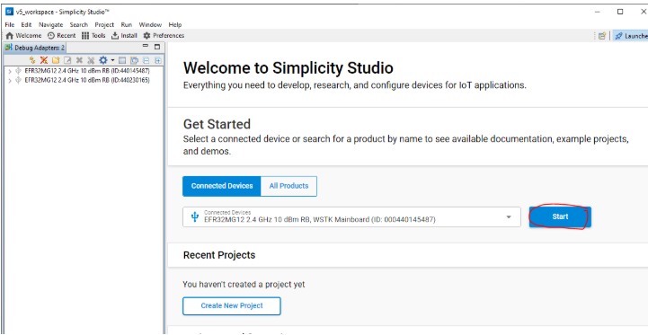
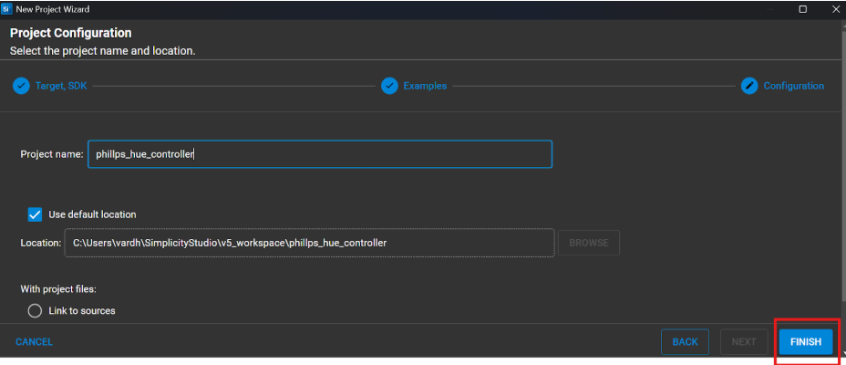
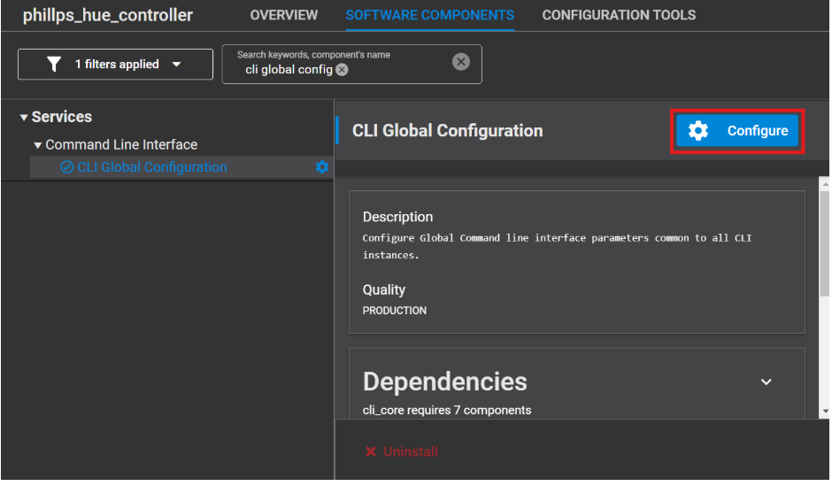
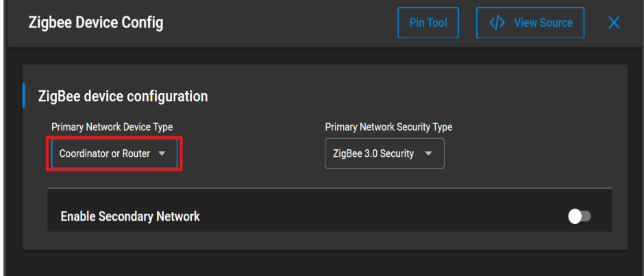
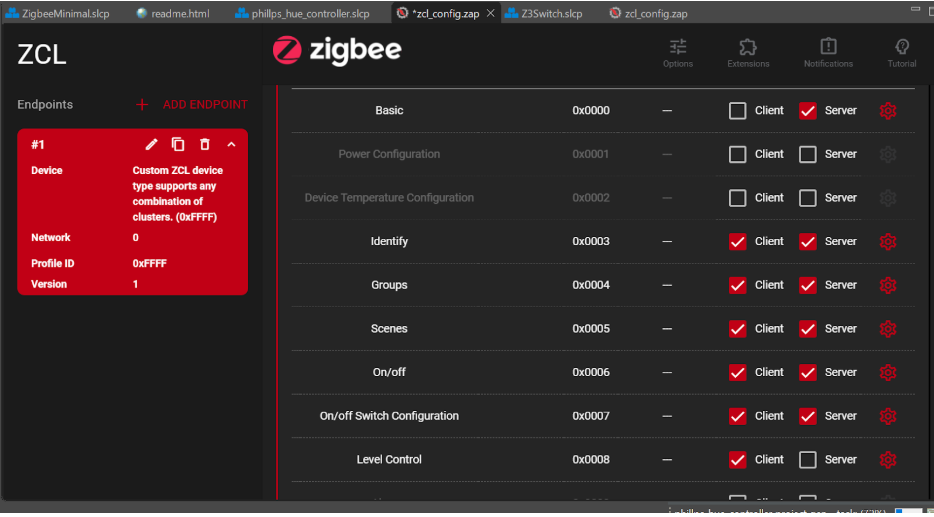

# Phillps-Hue-Control-using-EFR32MG
This project demonstrates how to control a Philips Hue smart bulb on a custom Zigbee network using Silicon Labs EFR32MG boards. In this version the application is kept minimal and no CLI commands are needed. The coordinator forms the network and opens it for joining when a button on the board is pressed. Once the Hue bulb joins, its short address is captured automatically through callbacks, and the bulb can be controlled directly with the board button.

## 1. Creating the Zigbee Minimal Application

Open **Simplicity Studio** and go to the Welcome view. From there, click on **Start** to begin setting up the project.



### Creating a New Project  

Choose to create a new project and select the **Zigbee Minimal** example as the starting point. This template provides the basic stack configuration, which we will extend with our application logic.  




---

## 2. Configuring the Project as a Zigbee Controller  

To control a Hue bulb, the application needs to combine both roles:  
- **Light** (to create and open the network)  
- **Switch** (to send ZCL commands)  

This way, a single device can form the Zigbee network and also control the bulb.
### Step 1: CLI Global Configuration  

In **Software Components**, enable the **CLI** and change the prompt to **Controller** for clarity.  

  

### Step 2: Install the Required Components  

From the software components, enable the following:  

- **Network Creator**  
  Creates a new Zigbee network when triggered from the application.  

- **Network Creator Security**  
  Adds security settings so that new devices can join safely.  

- **Zigbee Pro Stack** (Zigbee → Stack → Pro Core)  
  Provides the core Zigbee protocol implementation used by the application.  

- **Network Steering**  
  Allows the coordinator to open the network for a limited time so that devices like the Hue bulb can join automatically.  

- **Update TC Link Key**  
  Ensures that the Trust Center link key is updated when a new device joins, improving network security.  

- **Simple Button** (add two instances: `btn0` and `btn1`)  
  Provides hardware button inputs so the application can react to user actions. In this setup, one button is used for forming/opening the network and the other for sending commands.  

- **Zigbee Device Configuration** (set as both **Coordinator** and **Router**)  
  Configures the device to form the network (Coordinator role) and at the same time forward traffic in the network (Router role).  

  

## 3. ZCL Advanced Platform (ZAP) Configuration  

Open the **ZAP Tool** and set up the Zigbee endpoints. Create a custom cluster that will be used to communicate with the Philips Hue light.  



After configuring the endpoints, save your changes and build the project. Once the build is complete, flash the generated `.s37` file onto the device.  


## 4. Controlling the Hue Bulb with Board Buttons  

In this version, the application is fully event-driven. The board handles network creation, joining, and control without any CLI commands.  

### Step 1. Create and open the network with BTN0  

When **BTN0** is pressed, the firmware schedules an event that:  
1. Checks the current network state  
2. Forms a new Zigbee network if none exists  
3. Opens the network for joining  

This replaces the CLI commands `plugin network-creator start 1` and `plugin network-creator-security open-network`.  

*Screenshot placeholder:*  
``  

> Note  
> A **centralized Zigbee network** is used, with the coordinator also acting as the Trust Center. This ensures stable key handling and predictable join behaviour.  

### Step 2. Allow the Hue bulb to join  

Put the Hue bulb into pairing mode. Once it joins, the **Serial 1** console will display the join message. The join callback automatically captures the bulb’s **short ID**, so there is no need to enter it manually.  

*Screenshot placeholder:*  
``  

### Step 3. Toggle the bulb with BTN1  

Press **BTN1** to toggle the Hue light. The application fills the Zigbee On/Off command and unicasts it to the stored short ID on the Hue endpoint.  

*Screenshot placeholder:*  
``

---

## 5. Project Flow  

The following diagram gives an overview of the entire process, from powering on the board to toggling the Hue bulb:  

```mermaid
flowchart TD
    A[Power on / Reset] --> B[Init buttons & events]

    B --> C{BTN0 pressed?}
    C -- Yes --> D[Create Zigbee network]
    D --> E[Open network for joining]

    E --> F[Hue bulb joins]
    F --> G[Store Hue short ID]

    G --> H{BTN1 pressed?}
    H -- Yes --> I[Send ZCL On/Off Toggle]
    I --> J[Hue bulb toggles light]

    H -- No --> K[Idle loop / wait]

````

## Summary  

This project showcases how a Philips Hue bulb can be integrated into a custom Zigbee network built on Silicon Labs EFR32MG boards. The design is event-driven and minimal, with no need for CLI commands. Network creation and opening are triggered with a button press, and once the Hue bulb joins, its short ID is captured automatically through callbacks. A second button then sends Zigbee On/Off commands to the stored short ID, allowing direct control of the bulb.  

The project includes:  
- Implementing an event that creates and opens the Zigbee network on **BTN0 press**  
- Capturing the Hue bulb’s **short ID automatically** via join callback  
- Using **BTN1** to send ZCL On/Off Toggle commands to the bulb  
- Setting up **ZAP endpoint configuration** for communication with the Hue bulb  
- Managing device state and interaction through **UART logs and GPIO inputs**  


---
